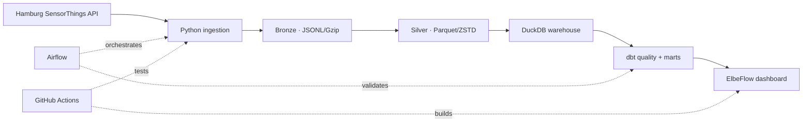

# Hamburg Urban Mobility Lakehouse

An end-to-end data engineering portfolio project that turns Hamburg's official StadtRAD sensor streams into a reliable historical lakehouse and a live decision dashboard.

The source currently exposes **360 bicycle stations**, observations dating back to **2019**, and approximately **210 million five-minute records that can be backfilled**. The committed dashboard snapshot contains 4,900+ recent verified observations and refreshes from the live API when the site opens.

## What this demonstrates

- Python ingestion with pagination, bounded retries and incremental backfills
- immutable JSONL/Gzip bronze storage and partitioned Parquet silver storage
- DuckDB analytics, dbt transformations and explicit data contracts
- Airflow orchestration with retry and single-run safeguards
- a responsive React/TypeScript dashboard with live API fallback
- Docker packaging, automated tests and GitHub Actions CI
- a design that can move to Azure Data Lake + Databricks without changing its contracts

## Architecture



## Run the dashboard

Requirements: Node.js 22+ and pnpm.

```bash
pnpm install
pnpm dev
```

Open `http://localhost:3000`. The dashboard renders immediately from the verified snapshot, then tries the official live endpoint.

## Build the data platform

Requirements: Python 3.11+.

```bash
python -m venv .venv
source .venv/bin/activate
python -m pip install -e ".[dev,dbt]"
```

Refresh the compact dashboard dataset:

```bash
hamburg-mobility snapshot
```

Run a safe one-day sample backfill, compact it to Parquet and validate it:

```bash
hamburg-mobility backfill --start 2026-08-08 --end 2026-08-09 --station-limit 10
hamburg-mobility compact
hamburg-mobility quality
cd transform && dbt build --profiles-dir .
```

Backfill the entire available history by omitting `--station-limit` and expanding the dates. The job is resumable: completed monthly partitions are skipped by default.

```bash
hamburg-mobility backfill --start 2019-07-26 --end 2026-08-10
```

The full dataset is intentionally generated outside Git. See [the architecture decisions](docs/architecture.md) for partitioning, idempotency and the cloud migration path.

## Repository map

```text
app/                  React dashboard and live API route
src/hamburg_mobility/ Python ingestion, snapshot, compaction and quality jobs
airflow/dags/          Scheduled production workflow
transform/             dbt staging models, marts and tests
tests/                 Python and server-rendered dashboard tests
public/data/           Small verified snapshot, safe for Git
docs/                  Engineering decisions
```

## Data source and licence

Data comes from the [Hamburg Urban Data Platform — StadtRAD](https://suche.transparenz.hamburg.de/dataset/stadtrad-stationen-hamburg39), published by the Freie und Hansestadt Hamburg under **DL-DE-BY-2.0**. Timestamps are supplied in UTC and shown in the dashboard in Europe/Berlin time.

## Engineering trade-off

This repository optimizes for reproducibility. It ships enough recent real data to review the product instantly, while the historical pipeline can rebuild the large dataset directly from its authoritative source. That keeps clones fast, provenance clear and storage costs under control.
