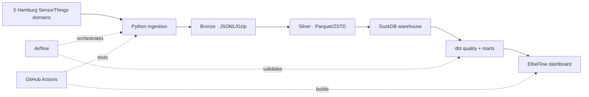

# Hamburg Urban Mobility Lakehouse

An end-to-end data engineering portfolio project that turns five official Hamburg mobility systems into a reliable historical lakehouse and a live decision dashboard.

The current catalogue contains **84,191 SensorThings streams**, coverage reaching back to **2009**, and an estimated **459 million scheduled observations** that can be backfilled. Event-driven traffic-light and charging observations are additional and deliberately excluded from that estimate. The repository also ships a compressed sample of **102,994 verified real observations** so reviewers can inspect substantial data immediately.

| Domain | Streams | Coverage | Cadence |
|---|---:|---:|---:|
| Traffic lights and detectors | 80,276 | 2009 → live | event-driven |
| Public EV charging | 2,367 | 2026 → live | event-driven |
| Motor traffic counters | 829 | 2026 → live | 15 minutes |
| Permanent cycle counters | 359 | 2020 → live | 5 minutes |
| StadtRAD availability | 360 | 2019 → live | 5 minutes |

## What this demonstrates

- source-configured Python ingestion with pagination, bounded retries and incremental backfills
- immutable JSONL/Gzip bronze storage and source/year/month-partitioned Parquet silver storage
- DuckDB analytics, dbt transformations and explicit data contracts
- Airflow orchestration with retry and single-run safeguards
- a responsive React/TypeScript dashboard with live API fallback
- Docker packaging, automated tests and GitHub Actions CI
- a design that can move to Azure Data Lake + Databricks without changing its contracts

## Architecture



## Run the dashboard

Requirements: Node.js 22+ and pnpm.

```bash
pnpm install
pnpm dev
```

Open `http://localhost:3000`. The dashboard renders immediately from the verified snapshot, then tries the official live endpoint.

## Build the data platform

Requirements: Python 3.11+.

```bash
python -m venv .venv
source .venv/bin/activate
python -m pip install -e ".[dev,dbt]"
```

Refresh the compact dashboard dataset:

```bash
hamburg-mobility snapshot
```

Rebuild the committed multi-source sample (about 100K real rows):

```bash
hamburg-mobility sample --streams-per-source 20
```

Run a safe one-day sample backfill, compact it to Parquet and validate it:

```bash
hamburg-mobility backfill --source motor-traffic --start 2026-08-08 --end 2026-08-09 --station-limit 10
hamburg-mobility compact
hamburg-mobility quality
cd transform && dbt build --profiles-dir .
```

Backfill any configured domain by choosing `--source`, omitting `--station-limit` and expanding the dates. The job is resumable: completed monthly partitions are skipped by default.

```bash
hamburg-mobility backfill --source stadtrad --start 2019-07-26 --end 2026-08-10
hamburg-mobility backfill --source cycle-counters --start 2020-01-17 --end 2026-08-10
```

The full dataset is intentionally generated outside Git. See [the architecture decisions](docs/architecture.md) for partitioning, idempotency and the cloud migration path.

## Repository map

```text
app/                  React dashboard and live API route
src/hamburg_mobility/ Python ingestion, snapshot, compaction and quality jobs
airflow/dags/          Scheduled production workflow
transform/             dbt staging models, marts and tests
tests/                 Python and server-rendered dashboard tests
public/data/           Dashboard snapshot + 100K-row compressed verified sample
docs/                  Engineering decisions
```

## Data source and licence

Data comes from the Freie und Hansestadt Hamburg's official SensorThings services: [StadtRAD](https://suche.transparenz.hamburg.de/dataset/stadtrad-stationen-hamburg39), [cycle counters](https://suche.transparenz.hamburg.de/dataset/verkehrsdaten-rad-infrarotdetektoren-hamburg7), [motor traffic](https://suche.transparenz.hamburg.de/dataset?query=Verkehrsdaten%20Kfz%20Infrarotdetektoren), [EV charging](https://suche.transparenz.hamburg.de/dataset/elektro-ladestandorte-hamburg40) and [traffic-light process data](https://suche.transparenz.hamburg.de/dataset/traffic-lights-data-hamburg3). Data is published under **DL-DE-BY-2.0**. Timestamps are supplied in UTC and shown in Europe/Berlin time.

## Engineering trade-off

This repository optimizes for reproducibility. The 100K-row sample is large enough for immediate review, while hundreds of millions of scheduled records and the event feeds are rebuilt directly from authoritative APIs into local or cloud object storage. Git stays fast, provenance stays clear and the distinction between observed counts and coverage-based estimates remains explicit.
