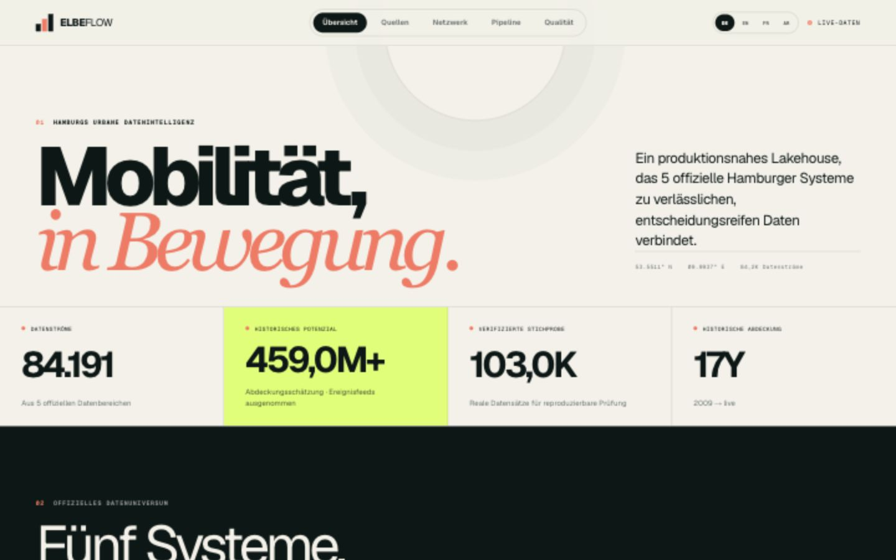
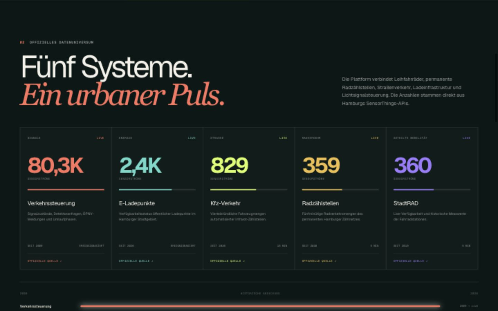
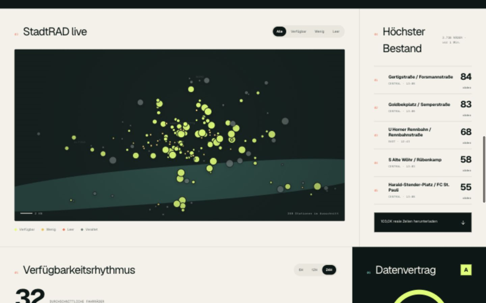
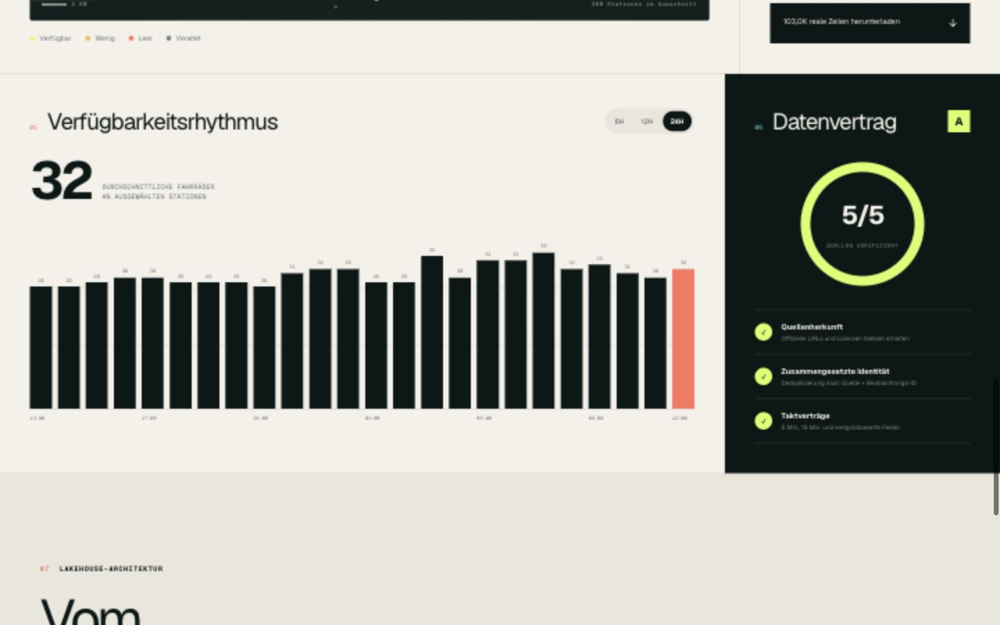
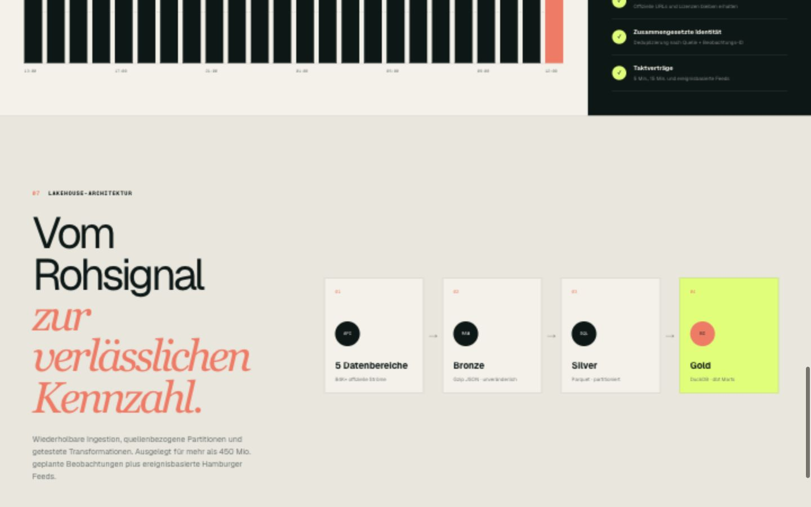
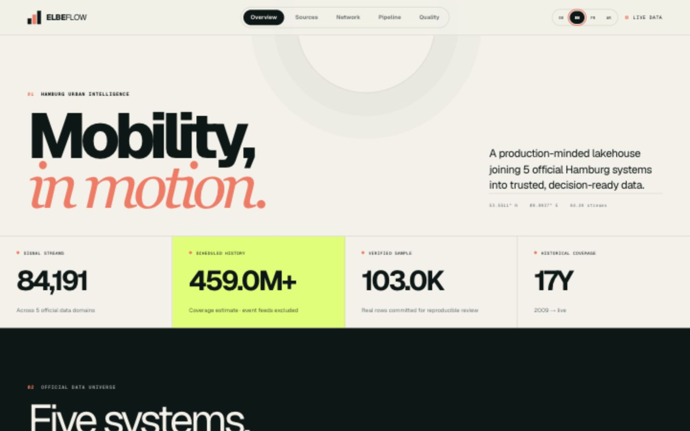
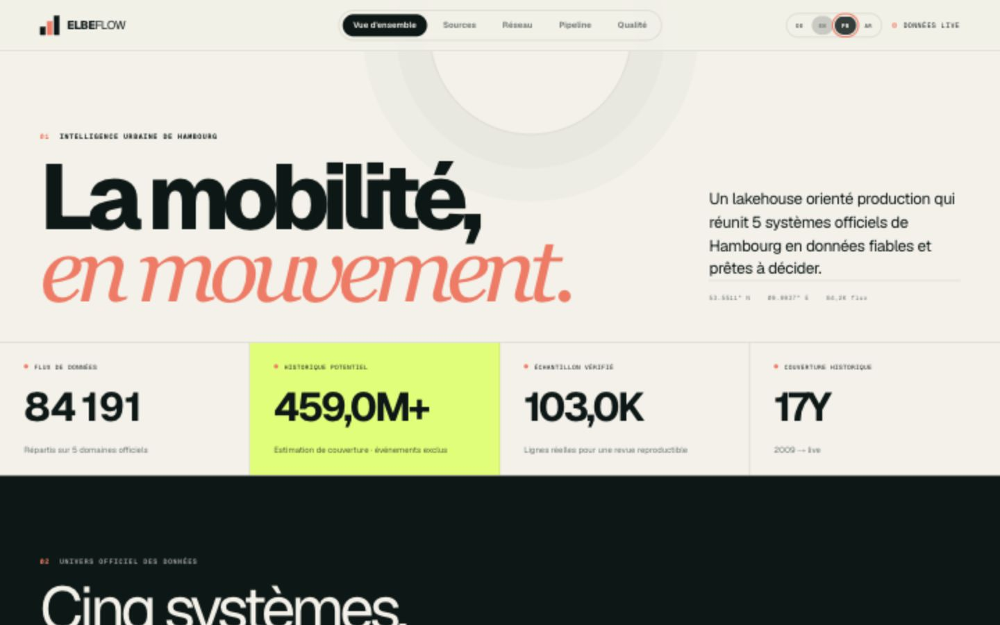
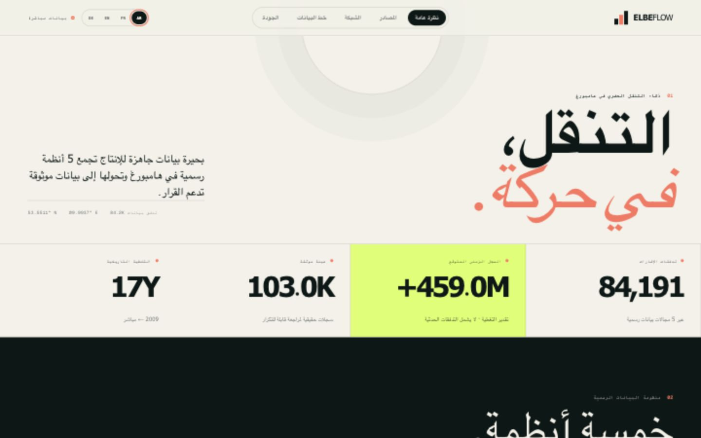
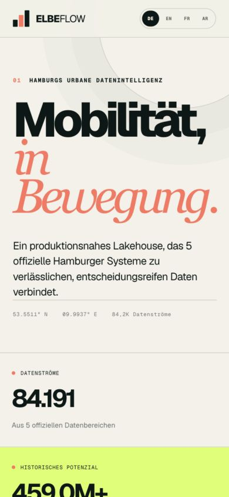
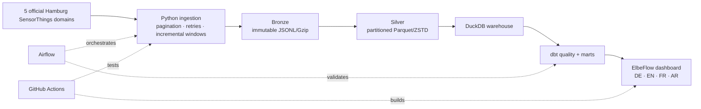

# ElbeFlow · Hamburg Urban Mobility Lakehouse


An end-to-end data engineering portfolio project that turns five official Hamburg mobility systems into a reproducible historical lakehouse and a multilingual decision dashboard. It demonstrates ingestion, partitioning, orchestration, quality contracts, analytics and product delivery in one repository.



## Why this project stands out

| Metric | Verified value | Meaning |
|---|---:|---|
| Official data domains | **5** | Traffic lights, EV charging, motor traffic, cycle counters and StadtRAD |
| SensorThings streams | **84,191** | Exact source catalogue represented by the application |
| Scheduled observations | **~459 million** | Reproducible coverage × cadence estimate; event feeds excluded |
| Committed real sample | **102,994 rows** | Verified official observations, Gzip-compressed and SHA-256 protected |
| Historical coverage | **2009 → live** | Earliest source coverage through the current official endpoints |
| Interface languages | **4** | German by default, English, French and Arabic with true RTL layout |

The full history is generated outside Git because it can exceed **459 million scheduled observations**, plus event-driven records. The repository stays quick to clone while still shipping a substantial, inspectable real-data sample.

## Product tour

### 1. One catalogue for five official mobility domains

The source atlas makes scale, cadence, historical reach and ingestion strategy explicit for every domain.



### 2. Live network intelligence

The operational view combines station geography, bike availability, capacity and ranking signals. If the official endpoint is unavailable, the interface keeps a recent verified snapshot and clearly labels its status.



### 3. Data quality that is visible, not implied

The dashboard exposes freshness, completeness, validity, uniqueness and the data contract used by the pipeline.



### 4. Recruiter-readable architecture

The architecture screen connects source APIs to immutable bronze files, Parquet silver data, DuckDB, dbt marts and the product layer.



## Multilingual and responsive UI

German is the default. The language switcher also provides English, French and Arabic; Arabic changes both copy and document direction to RTL. The dashboard is fully responsive.

<table>
  <tr>
    <td width="50%"></td>
    <td width="50%"></td>
  </tr>
  <tr>
    <td width="50%"></td>
    <td width="50%"></td>
  </tr>
</table>

## How a recruiter can review it in five minutes

1. Open the dashboard and use `DE / EN / FR / AR` in the header.
2. Review **Quellen** to compare the five official source domains.
3. Open **Live-Netz** to inspect spatial and station-level analytics.
4. Check **Qualität** for the measurable data contract.
5. Finish with **Pipeline** to understand the engineering architecture.
6. Read the [English illustrated project report](output/pdf/elbeflow-project-report.pdf) for a screen-by-screen walkthrough.

## Run the dashboard

Requirements: Node.js 22.13+ and pnpm.

```bash
git clone https://github.com/wezdar/hamburg-urban-mobility-lakehouse.git
cd hamburg-urban-mobility-lakehouse
pnpm install
pnpm dev
```

Open [http://localhost:3000](http://localhost:3000). The UI renders from the verified snapshot immediately, then attempts to refresh from Hamburg's official live endpoint.

Production check:

```bash
pnpm lint
pnpm test
```

Regenerate the illustrated PDF report after updating the screenshots:

```bash
python -m pip install -e ".[report]"
python scripts/build_project_report.py
```

## Build the data platform

Requirements: Python 3.11+.

```bash
python -m venv .venv
source .venv/bin/activate
python -m pip install -e ".[dev,dbt]"
```

Refresh the dashboard catalogue and verified live snapshot:

```bash
hamburg-mobility snapshot
```

Rebuild the committed multi-source sample of roughly 100K official rows:

```bash
hamburg-mobility sample --streams-per-source 20
```

Run a bounded backfill, compact it to Parquet and validate the result:

```bash
hamburg-mobility backfill \
  --source motor-traffic \
  --start 2026-08-08 \
  --end 2026-08-09 \
  --station-limit 10
hamburg-mobility compact
hamburg-mobility quality
cd transform && dbt build --profiles-dir .
```

The monthly, resumable backfill can be expanded to the full official history:

```bash
hamburg-mobility backfill --source stadtrad --start 2019-07-26 --end 2026-08-10
hamburg-mobility backfill --source cycle-counters --start 2020-01-17 --end 2026-08-10
```

## Architecture



### Storage layout

```text
data/
├── bronze/source=SOURCE/year=YYYY/month=MM/stream_id=ID/*.jsonl.gz
├── silver/mobility_observations/source=SOURCE/year=YYYY/month=MM/*.parquet
└── warehouse.duckdb
```

- Bronze objects are immutable and replayable.
- Silver data is deduplicated by observation ID and compressed with Zstandard.
- Half-open monthly windows prevent boundary overlap.
- Deterministic paths and completion markers make backfills resumable.
- DuckDB and dbt provide local analytical marts without a managed-warehouse bill.

## Official data universe

| Domain | Streams | Coverage | Cadence | Volume treatment |
|---|---:|---:|---:|---|
| Traffic lights and detectors | 80,276 | 2009 → live | Event-driven | Not guessed in volume estimate |
| Public EV charging | 2,367 | 2026 → live | Event-driven | Not guessed in volume estimate |
| Motor traffic counters | 829 | 2026 → live | 15 minutes | Included |
| Permanent cycle counters | 359 | 2020 → live | 5 minutes | Included |
| StadtRAD availability | 360 | 2019 → live | 5 minutes | Included |

The `estimatedScheduledRows` metric is intentionally conservative: it covers only scheduled feeds. Traffic-light and EV charging events add further records, but the project does not invent a count for them.

## Reliability and data contracts

- bounded HTTP retry with exponential backoff
- atomic completion of downloaded partitions
- source + observation ID deduplication
- explicit normalization of instant and interval SensorThings timestamps
- checks for required keys, duplicate IDs, invalid timestamps and negative bike counts
- exact committed-sample row count and SHA-256 verification
- verified dashboard fallback when a live public API is temporarily unavailable
- automated Python, server-rendered UI, lint and production-build checks

## Repository map

```text
app/                  React/TypeScript dashboard, localization and live API route
src/hamburg_mobility/ Python ingestion, sampling, compaction and quality jobs
airflow/dags/          Scheduled production workflow
transform/             dbt staging models, marts and tests
tests/                 Python and server-rendered dashboard tests
public/data/           Dashboard snapshot + verified 102,994-row real sample
docs/screenshots/      Recruiter-facing product captures
output/pdf/            Illustrated English project report
```

## Data provenance and licence

The data comes from the Freie und Hansestadt Hamburg's official SensorThings services: [StadtRAD](https://suche.transparenz.hamburg.de/dataset/stadtrad-stationen-hamburg39), [cycle counters](https://suche.transparenz.hamburg.de/dataset/verkehrsdaten-rad-infrarotdetektoren-hamburg7), [motor traffic](https://suche.transparenz.hamburg.de/dataset?query=Verkehrsdaten%20Kfz%20Infrarotdetektoren), [EV charging](https://suche.transparenz.hamburg.de/dataset/elektro-ladestandorte-hamburg40) and [traffic-light process data](https://suche.transparenz.hamburg.de/dataset/traffic-lights-data-hamburg3).

Source data is published under **DL-DE-BY-2.0**. Timestamps are stored in UTC and presented in Europe/Berlin time. Application code is MIT-licensed. See [architecture decisions](docs/architecture.md) for detailed trade-offs and the cloud migration path.
